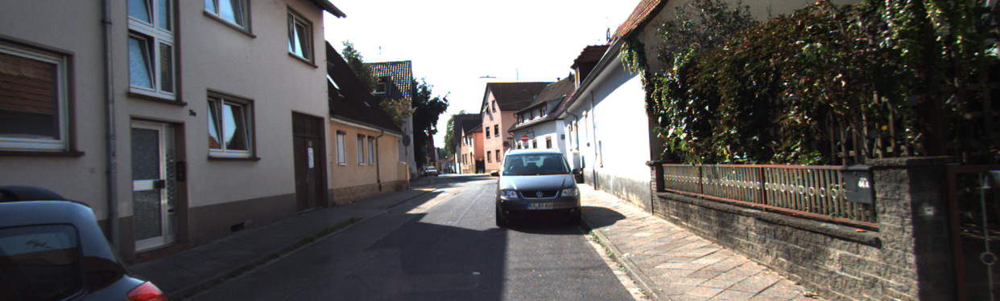
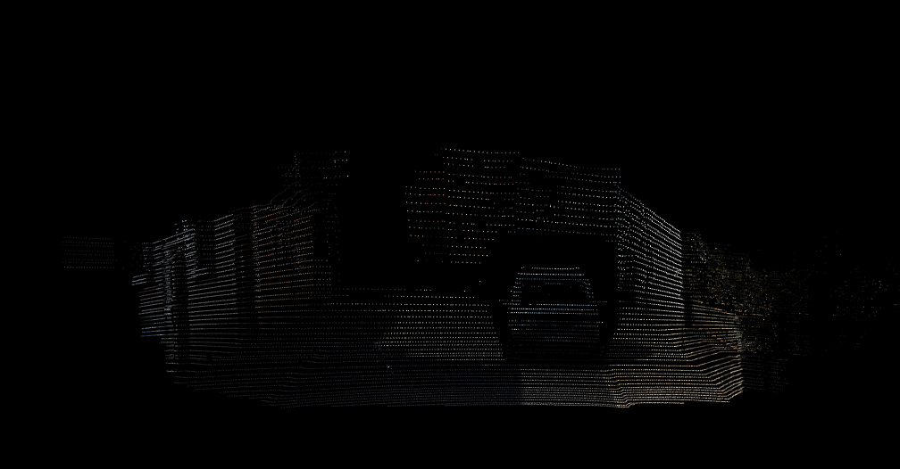

# RosLiCamFuse (ROS Lidar Camera Fuse)

This tool reads the images and point clouds' messages from a rosbag, synchronizes them, and applies the calibration parameter to color the point clouds base on images.



## Build
Make sure you installed:
```
sudo apt install libpcl-dev
```
and

`OpenCV 3.4.2`


Then, move the repo to the directory `src` in your catkin workspace. Example:
```
mv lidar_cam_proj catkin_ws/src
```
Finally, install the package
```
cd catkin_ws
catkin_make
```

## Quickrun Examples

```bash
rosrun lidar_cam_fuse fuse _out_dir:="/home/ductm/catkin_ws/src/lidar_cam_proj/data/" _bag:="/home/ductm/ros1_bags/sample.bag" _cam_topic:="/camera/tricam/mid/image_raw/compressed" _lidar_topic:="/lidar/points_raw" _extrinsic:="/home/ductm/catkin_ws/src/lidar_cam_proj/calib/extrinsic.txt" _intrinsic:="/home/ductm/catkin_ws/src/lidar_cam_proj/calib/intrinsic.txt" _distortion:="/home/ductm/catkin_ws/src/lidar_cam_proj/calib/distortion.txt"
```

or

```bash
roslaunch lidar_cam_fuse lidar_cam_fuse.launch
```

## Config
### Calibration
Write your extrinsic, intrinsic & distortion parameters in .txt by following these format:

`Note`: The spaces between numbers are not important.

#### Extrinsic
```
-0.0090788  0.0851177   0.9963295   0.85383986
-0.9999462  -0.0057710  -0.0086187  0.154835
0.0050163   -0.9963542  0.0851655   1.03181427
```

#### Intrinsic
```
3974.66   0         934.31
0         3970.66   575.35
0         0         1.0
```

#### Distortion
```
-0.328462 0.078086 -0.004439 -0.000034 0.000000
```
`Note`: If the image is already undistorted (exp: images in KITTI), set all coefficients to 0:
```
0 0 0 0 0
```

## Launch
To define the paths to required files, you edit `launch/lidar_cam_fuse.launch`
* out_dir: Directory where synchronized image, pointcloud & colored point cloud saved.
* bag: Path to the bag file.
* cam_topic: Topic to read messages from camera. (Currently, only support CompressedImage. You can change CompressedImage into Image to run with Image messages)
* lidar_topic: Topic to read messages from lidar.
* extrinsic/intrinsic/distortion: Paths to caliration files.

## Debug
* `Failed to find match for field 'rgb'.` appears when we read a point cloud without rgb color. We dont need to worry about it.
* If the projection is completely wrong, it's likely due to the extrinsic params, the distortion and intrinsic params does not affect much the result.
* I strongly recommend using images with vertical, horizontal colored or a segmented ones to verify the accuracy of your projection.